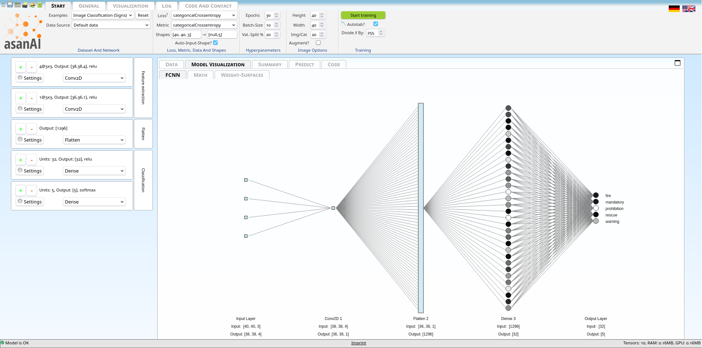
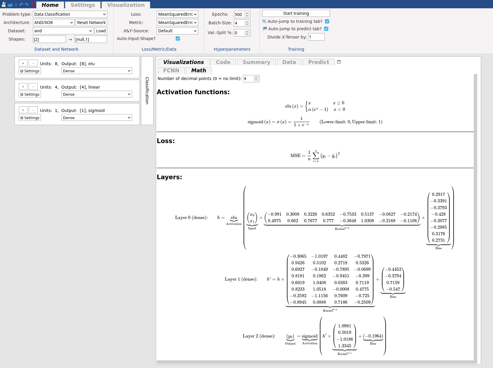
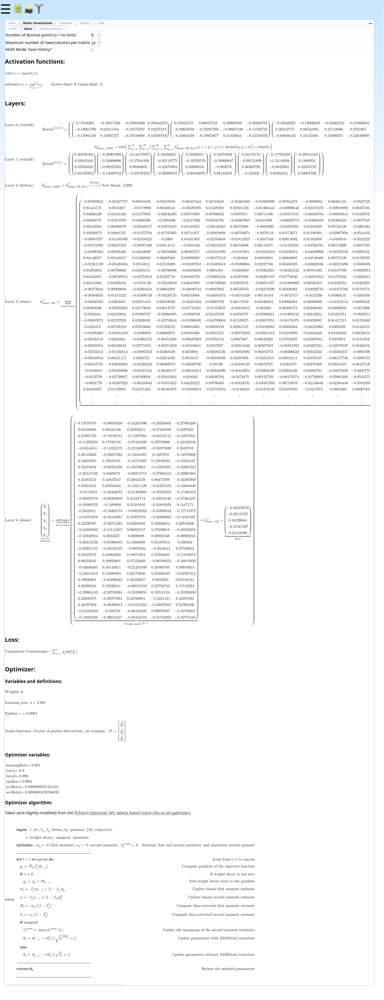
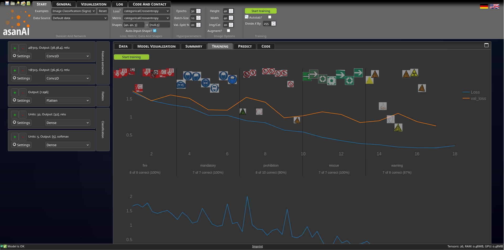
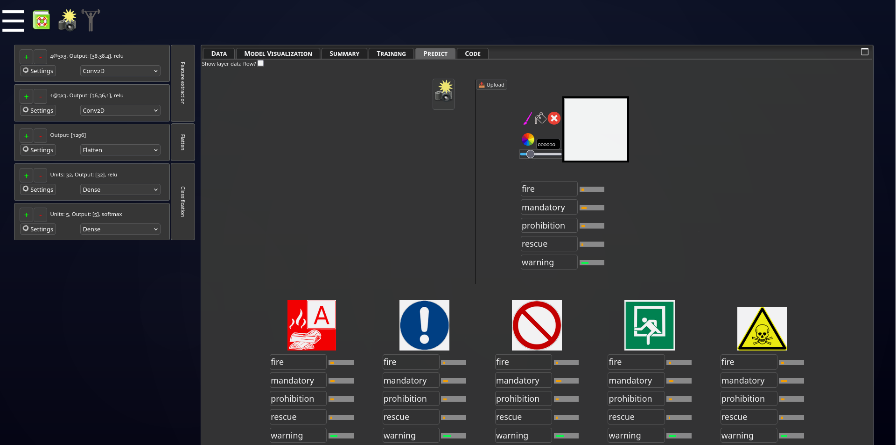
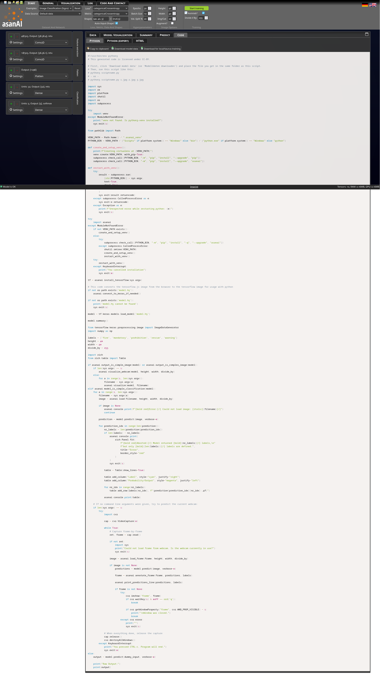
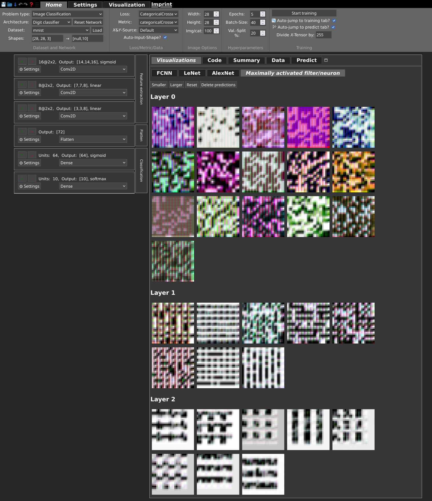

<p align="center">

</p>

<p align="center">

</p>

# What is asanAI?

asanAI is a no-code, offline-first machine learning toolkit which runs in any modern browser.

<p align="center">

</p>

All global options can be adjusted from the foldable ribbon at the top of the page.  
There is even a "Dark mode" :)

<p align="center">

</p>

A neural network can be designed simply using the layers structure from the panel on the left.  
An instant visualization of the network structure enhances understanding.

<p align="center">

</p>

Layers are shown in their semantical categories.  
Each layer has its own set of internal configurations which is accessible from the `Settings` button in each layer.

Unless the *Expert mode* being activated (from the top robbon), various guiding mechanisms assist users in their decision
e.g., mismatching layers cannot be selected, wrong values will be highlighed, etc.

<p align="center">


</p>

Once the network and input data are ready, the training can be started by clicking on the *Start training* button from the top ribbon.  
During the training, the internal process and progress of the network can be tracked.

<p align="center">

</p>

For simple networks, in addition to general visualizations, the *Math Mode* offers a detailed (and live) look at the underlying calculations in each layer.

<p align="center">

</p>

As soon as the training process begins, the progress of the model can be tested on the *Predict* tab.  
For image data, the testing can be done via uploaded photos, drawing directly on the screen, or live camera stream.  
For text data, the test data can be either uploaded as a file or being directly inserted in the text area.

<p align="center">

</p>

Beside the default test datasets, users can upload their own data in *CSV*, *Image*, or *Tensor* formats.  
Several assistances suppor the input process and facilitate the data upload (data never leaves the local computer).  

<p align="center">

</p>

Similar to the default sample dataset, the live prediction for users data can be initiated in parallel, as soon as the training process is started.  

<p align="center">

</p>

To enhance explainability, additional visualization tools can help inspect internal weight matrices, activated neurons, or input data using GradCam representation.

<p align="center">

</p>
<p align="center">

</p>

At every stage of design, training, and verification of models, the automatic generated python code can be downloaded.
In addition, the training data as well as the model structure and weights can be downloaded as separate files (from the top ribbon).

<p align="center">

</p>


# How to use asanAI?

> [!NOTE]
> If you would like to use asanAI (as it is), simply follow this link: [asanAI Toolkit](https://asanai.scads.ai)

## Self-/local hosting
If you would like to host your own version, or if you would like to change the default values, add other examples, customize the theme, or do any other changes to the core of asanAI then follow the instructions below.
> [!TIP]
> Take a look at the [Introduction](https://asanai.scads.ai/cosmo_ok/index.php?&start_cosmo=1) and the [Exhibition](https://asanai.scads.ai/exhibition) version for some inspirations. These variations are currently in use in kiosk-mode at exhibitions and public events. Their code is also avaialble in this repository.
<details>
<summary>click here to expand the installation instructions...</summary>

### Using Docker

The installation script [docker.sh](https://github.com/NormanTUD/asanAI/blob/master/docker.sh) installs and configures all requirments.  
We have tested this script on Debian, however it should work on most debian-based operating systems (such as Ubuntu).

#### On Debian
Clone this repository and execute the installation script as following:

```Shell
bash docker.sh --local-port 5312
```

#### On Linux
(not tested but should work)
Clone this repository, then execute the following commands in a terminal one by one:

```Shell
LOCAL_PORT=5312
echo "LOCAL_PORT=$LOCAL_PORT" >> .env
sudo docker-compose build && sudo docker-compose up -d || echo "Failed to build container"
firefox localhost:$LOCAL_PORT/
```

#### On Windows
(not tested but should work)
Clone this repository, then execute the following commands in a terminal one by one:

```Shell
set LOCAL_PORT=5312
echo LOCAL_PORT=%LOCAL_PORT% >> .env
docker-compose build && docker-compose up -d || echo Failed to build container
start firefox localhost:%LOCAL_PORT%/
```

### Installation (no Docker)
For any reason you may decide to avoid using Docker and go for a navite installation.
This is also fairly straight forward.

#### Apache2 + PHP
Install Apache2 and PHP usign the package manager of your operating system.
They are required to assemble and serve the JS-files.

In the `php.ini`, increase the max file size as following:
```yaml
upload_max_filesize = 100M;
post_max_size = 100M;
```

#### MySQL (optional)
asanAI supports an optional login functionality which can be used for instance by teachers to instantly share contents in classrooms.  
To enable this functionality a MySQL instance is requires.  

> [!TIP]
> Run the following script for exporting python files on shared/remote hosts:
> ```console
> mkdir -p /var/www/tmp
> sudo chown -R www-user:$USER /var/www/tmp
> sudo chmod -R 775 /var/www/tmp
> ```
</details>

# System requirements
Using asanAI only requires a modern browser (javascript enabled).  

- GPU acceleration  
If the user's device is equipped with GPU, asanAI automatically utilizes the available GPU via *WebGL*.  
The *WebGL* functionality however, can be manually switched off from the top ribbon (General > CPU).  

- Smartphones  
asanAI is desgined with a responsive layout, thus it can be used on desktop computers, laptops, tablets, and smartphones.  
However, the user experience on small screens such as smartphones requires further improvement.

# Video tutorials
A series of [video tutorials](https://www.youtube.com/playlist?list=PLZkHu66nUK_6F59YAUZc6_sTzvGK3PCpk) about how to use asanAI is available on our YouTube channel.  


# Documentation (for advance users)
A draft of the documentation for advanced users is available [here](https://asanai.scads.ai/manual.html).  


# Please note
asanAI is under active developement.  
Although we do our best to keep this page up-to-date, some screenshots might differ from the active version.  
The latest version from this repository is always accessible via [asanAI.ScaDS.AI](https://asanai.scads.ai).  
If you encountered any problem using asanAI, please check [the issues](https://github.com/NormanTUD/asanAI/issues) and create a [new issue](https://github.com/NormanTUD/asanAI/issues/new/choose) if required.  
The online version of asanAI employs an automatic monitoring mechanism which submits an anonymized log to the server in case of a failure.


# Screenshots
<details>
<summary>Click here to see more screenshots of asanAI...</summary>














</details>


# Standing on the shoulders of giants

asanAI uses many different libraries under the hood. 
<details>
<summary>Click here to see the list...</summary>

[comment]: <> (BeginSources)

- [TensorFlow.js](https://www.tensorflow.org/js)

- [Prism](https://prismjs.com/)

- [Jquery-UI](https://jqueryui.com/)

- [d3.js](https://d3js.org/)

- [MathJax](https://www.mathjax.org/)

- [temml](https://temml.org/)

- [Convolution arithmetic](https://github.com/vdumoulin/conv_arithmetic)

- [TensorFlow.js Examples](https://github.com/tensorflow/tfjs-examples/tree/master/visualize-convnet)

- [MNIST](http://yann.lecun.com/exdb/mnist/)

- [Minify](https://github.com/matthiasmullie/minify.git)

- [atrament.js](https://github.com/jakubfiala/atrament)

- [Magic Wand](https://codepen.io/averyhw/pen/xyxKjO/)

- [JSManipulate](https://github.com/bennyschudel/JSManipulate)

- [hash-wasm](https://github.com/Daninet/hash-wasm)

- [plotly.js](https://plotly.com/javascript/)

- [jscolor](https://jscolor.com/)

- [zip.js](https://gildas-lormeau.github.io/zip.js/)

- [chatGPT](https://chatgpt.com/)

- [sparkle.js](https://www.cssscript.com/demo/sparkle-effect/)

- [Manicule](https://news.lib.wvu.edu/2017/08/28/the-first-post-it-note-the-manicule/)

- [Color Picker Icon](https://commons.wikimedia.org/wiki/File:Inkscape_icons_color_picker.svg)

- [Loading Icon](https://upload.wikimedia.org/wikipedia/commons/b/b1/Loading_icon.gif)

- [Fire Alarm Button](https://freesvg.org/drawing-of-fire-alarm-push-button)

- [A green circle icon with a(n) arrow-right symbol from the Emoji One BW icon font.](https://de.wikipedia.org/wiki/Datei:Eo_circle_green_arrow-right.svg)

- [Smooth arrow animation](https://codepen.io/vlt_dev/pen/NWMNzpE)

- [Multitouch tap.png](https://commons.wikimedia.org/wiki/File:Multitouch_tap.png)

- [html2canvas](https://html2canvas.hertzen.com/)

- [Colorpicker.svg](https://commons.wikimedia.org/wiki/File:Colorwheel.svg)

- [confetti.js](https://www.kirilv.com/canvas-confetti/)

- [Cosmo-Präsentation, Dr. Christoph Lehmann](https://tu-dresden.de/zih/die-einrichtung/struktur/dr-christoph-lehmann)

- [GNOME Desktop Icon Pack](https://commons.wikimedia.org/wiki/GNOME_Desktop_icons)

- [Aurora Background Easter Egg](https://codepen.io/rawcreative/pen/kabgzJ)

- [comment]: <> (EndSources)

</details>

# Sponsored by


