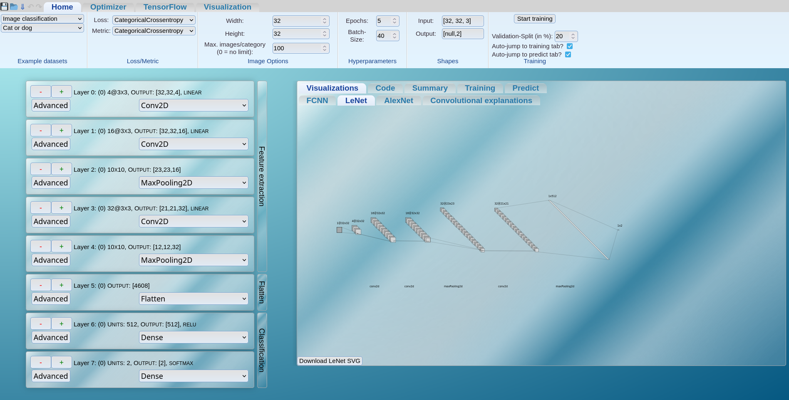
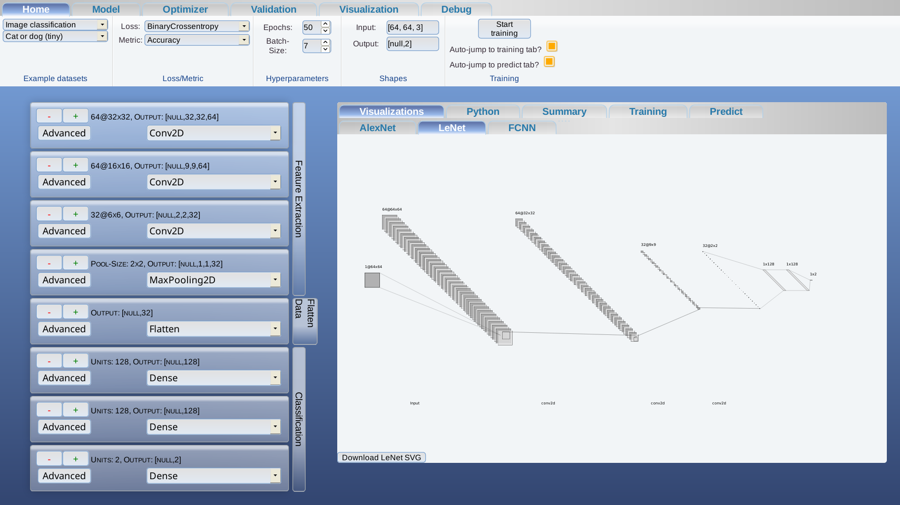
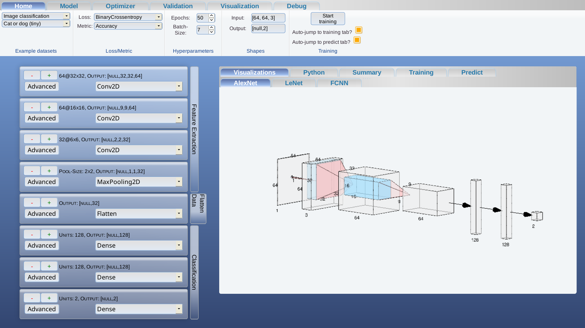

# TensorFlow.js Demonstrator

This is a more or less complete GUI for TensorFlow.js. With it, you can create and train models
fully in your browsers.

# Status

This is a very early alpha.

# Screenshots

# Installation

## Apache2 + PHP

Nothing more is needed. TensorFlow.js does not need any server-Backend because it runs fully in
the browser. The only thing PHP is needed for is to download the datasets for the default networks
offers. Everything else is just HTML/CSS/JS.

# Standing on the shoulders of giants

I use many different libraries to achieve this. This is a list of all the modules that I used
in creating this program:

- [TensorFlow.js](https://www.tensorflow.org/js)

- [NN-SVG](http://alexlenail.me/NN-SVG/LeNet.html)

- [Prism](https://prismjs.com/)

- [Jquery-UI](https://jqueryui.com/)

- [d3.js](https://d3js.org/)

- [MathJax](https://www.mathjax.org/)

- [tfjs-activation-functions](https://github.com/Polarisation/tfjs-activation-functions)

- [Convolution arithmetic](https://github.com/vdumoulin/conv_arithmetic)

- [Kaggle Cats and Dogs Dataset](https://www.microsoft.com/en-us/download/details.aspx?id=54765)

- [TensorFlow.js Examples](https://github.com/tensorflow/tfjs-examples/tree/master/visualize-convnet)

- [MNIST](http://yann.lecun.com/exdb/mnist/)

- [ChardinJS](https://heelhook.github.io/chardin.js/sequential.html)

- [computer-modern-web-font](https://github.com/dreampulse/computer-modern-web-font)

- [Clippy.js](https://www.smore.com/clippy-js)

- [Minify](https://github.com/matthiasmullie/minify.git)
