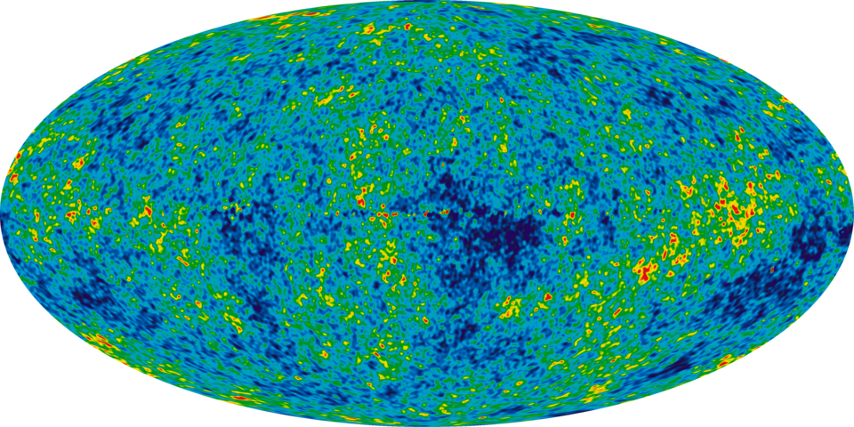
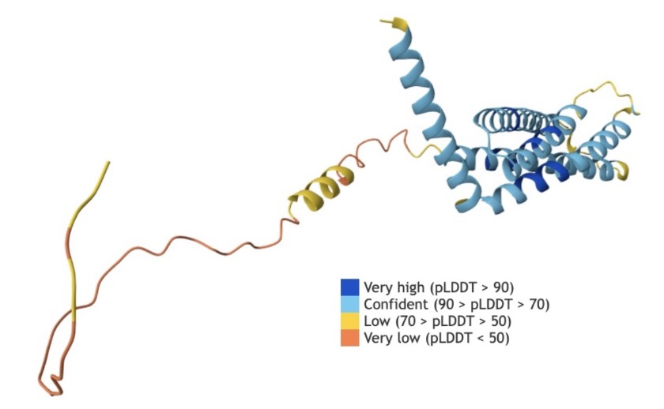
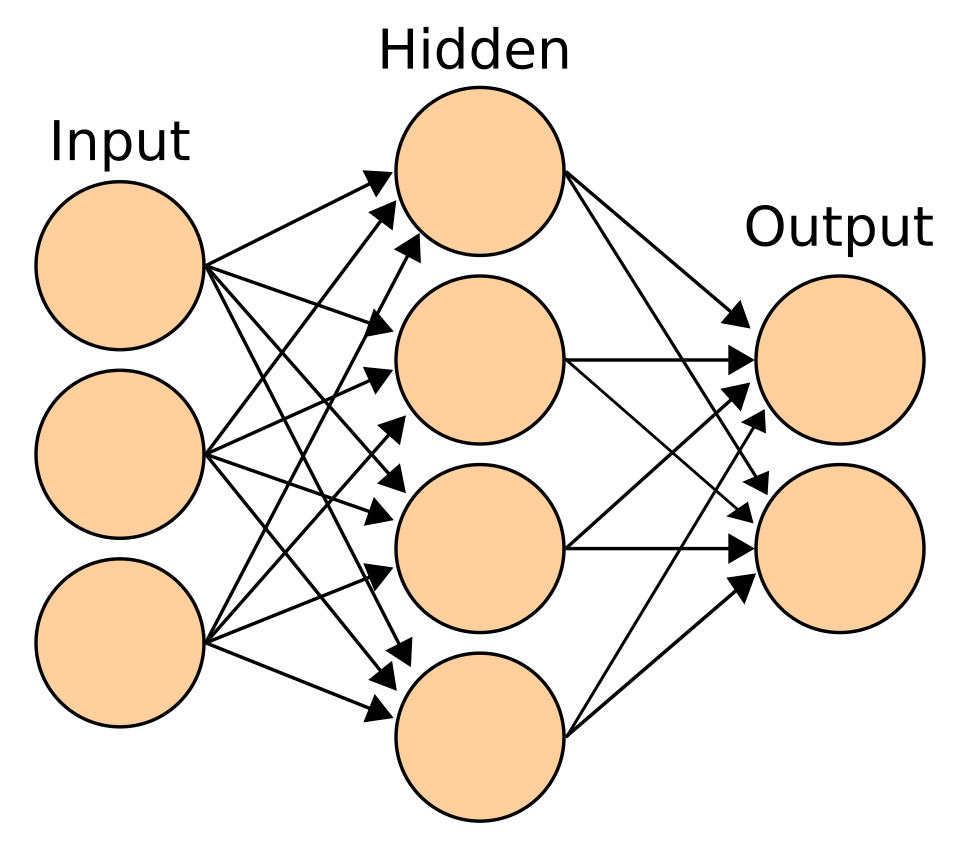
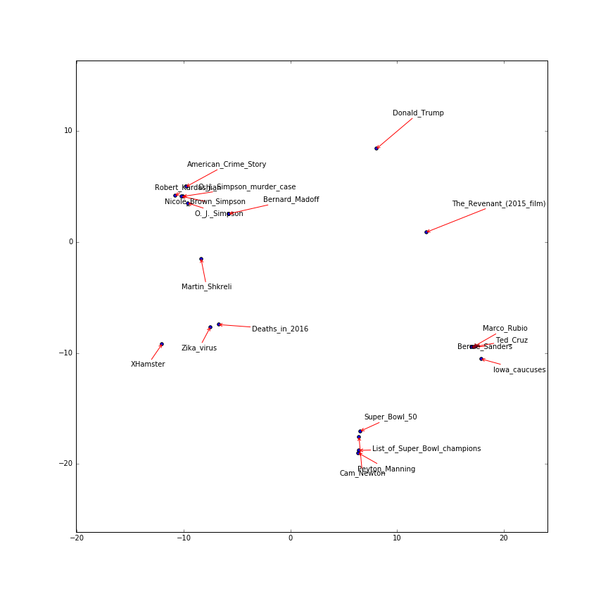

# From Big Bang to ChatGPT

*A free digital textbook that follows one thread — from the first tools and the
history of mathematics and machines, through the math of deep learning, to how modern
large language models actually work.*

It is a course, not a blog: the lessons are arranged in six parts, each building on the
last, and the prose is interleaved with **interactive, in-browser visualizations** so
you can *see and touch* the ideas rather than just read about them.

| The Big Bang | The first machines | The modern model |
| :---: | :---: | :---: |
|  |  |  |
| the story begins | Babbage's Analytical Engine | a model that folds a protein |

---

## The six parts

| Part | Title | What it covers |
| :---: | :--- | :--- |
| **1** | **Foundations** | Where we came from, what language is, and the mathematical bedrock beneath AI. |
| **2** | **How Neural Networks Learn** | The learning algorithm step by step — from loss functions to live training. |
| **3** | **Deep Learning & Vision** | Stacking layers, seeing images, and the engineering that makes depth possible. |
| **4** | **The Transformer Revolution** | Attention, embeddings, multimodal models, diffusion, and the post-transformer alternatives. |
| **5** | **Making AI Useful** | Fine-tuning, retrieval, search, safety, and the practical craft of working with LLMs. |
| **6** | **Bigger Questions** | The global AI ecosystem, the displaced prerequisites, and the open problems at the frontier. |

The through-line, in two images…

  
  

The left is the machine; the right is what the machine is *about* — words arranged by
meaning in a high-dimensional space.

---

## What makes it different

- **Interactive, not passive.** Every abstract idea ships with a visualization you can run
  in the browser — a live loss curve, a working backpropagation step, an attention map,
  a t-SNE of word embeddings.
- **Everything runs locally.** No sign-up, no account, no data leaves your browser.
- **Math-first, intuition-second.** The course does not hand-wave the math; it introduces
  each tool when the reader actually needs it, and shows why.
- **Honest about limits.** It teaches how LLMs work *and* where the folklore stops and
  the mechanism begins (see the *Common Myths and Misconceptions* lesson).

## How it is built

- **PHP templates + vanilla JavaScript**, served statically. No framework, no build step,
  no server-side compute.
- **Mathematics** is set with [TeXmacs/Temml](https://temml.org/); **charts** with
  Plotly, ECharts and Three.js; **live training** with TensorFlow.js.
- Every factual claim and every image is **cited** — sources live in
  [`literature.js`](literature.js) and are link-checked in CI.

## Where to read it

The course is served from the same host as the
[asanAI toolkit](https://asanai.scads.ai). Open the repository's `blog/index.php`
(or `blog/index_full.php` for the full linear reading order) to begin.

## Origin & credit

This work was developed by **Norman Koch** (norman.koch@tu-dresden.de) as a Software
Engineer at TU Dresden / ScaDS.AI. It reflects professional interest in AI but is largely
the product of personal time, driven by a wish to make these topics accessible.
